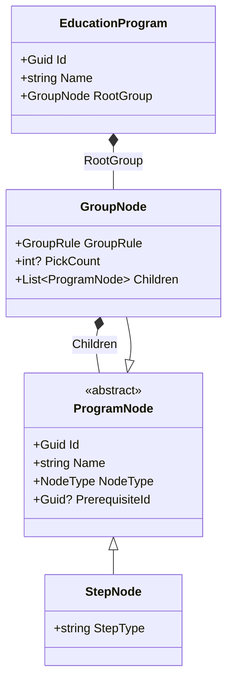

<div align="center">
  <h1>🚀 ProgramDesigner</h1>
  <p><strong>A .NET 10 Web API and Angular 19 SPA for modeling education programs.</strong></p>
  
  [](https://dotnet.microsoft.com/)
  [](https://angular.io/)
  []()
</div>

<hr/>

## ✨ Overview

ProgramDesigner is a full-stack application (Backend: **.NET 10 Web API**, Frontend: **Angular 19 SPA**) designed for modeling education programs as a recursive tree of steps and groups. 

A program can contain concrete activities such as *sessions, tests, and submissions*, plus nested groups that require either ordered completion (`InOrder`) or a choice among options (`Choice`). Nodes can depend on other nodes through prerequisites. The core engine features:
- **Validation:** Catches impossible prerequisites (self-references, forward-references, cycles).
- **Reachability Warnings:** Warns when a prerequisite may be unreachable because it lives inside a choice branch the participant might not pick.
- **Simulation:** An engine that computes one participant's current progress state from their selected choice paths and completed steps.
- **Interactive UI:** A beautiful web interface to compose program trees, visualize structures recursively, run the validation engine, and dynamically test simulations.

---

## 🤖 AI Tool Usage Note

This project was built using AI collaboration tools:
- **Claude** was used for high-level thinking, architecture design, and planning.
- **Antigravity** (Google DeepMind's agentic coding assistant) was used for direct code implementation, scaffolding, testing, and debugging.

---

## 🛠️ Setup Instructions

**Prerequisites:**
- [.NET 10 SDK](https://dotnet.microsoft.com/download)
- [Node.js](https://nodejs.org/en/) (v22.x or v24.x)

### 1. Start the .NET Backend API

```bash
# Clone the repository
git clone <repo-url>
cd ProgramDesigner

# Restore and build the solution
dotnet restore ProgramDesigner.slnx
dotnet build ProgramDesigner.slnx

# Run the API
dotnet run --project src\ProgramDesigner.Api\ProgramDesigner.Api.csproj --launch-profile http
```
The API will run at `http://localhost:5173`.

### 2. Start the Angular Frontend

In a new terminal window:
```bash
cd frontend
npm install
npm start
```
The Web App will run at `http://localhost:4200`.

### 3. Run the Test Suite
The .NET backend is heavily tested. To run the suite:
```bash
dotnet test ProgramDesigner.slnx
```

---

## 🏗️ Domain Data Model

The core model is generic and recursive, allowing it to represent *any* program tree.



- `EducationProgram` is the aggregate root.
- `StepNode` is a leaf activity with a free-form `stepType` (e.g., session, test).
- `GroupNode` contains child nodes and has a `groupRule` (`InOrder` or `Choice`).
- `PrerequisiteId` is a stored Guid reference gating access to a node and its subtree.

---

## 🔌 API Contract Overview

All API JSON communication uses `camelCase`. The node types are discriminated polymorphically via a `type` property.

### `POST /programs`
Creates and stores a program in memory. Clients pass `key` as a string, and `prerequisiteRef` to map dependencies easily.
* **Returns:** `201 Created` with the mapped tree and system-generated IDs.
* **Validates:** Rejects malformed structures (e.g., duplicate keys, invalid pick counts).

**Example Request:**
```json
{
  "name": "Computer Science",
  "rootGroup": {
    "name": "Computer Science",
    "groupRule": "inOrder",
    "children": [
      {
        "type": "group",
        "key": "Foundations",
        "name": "Foundations",
        "groupRule": "inOrder",
        "children": [
          { "type": "step", "name": "Intro to Computing", "stepType": "session" }
        ]
      },
      {
        "type": "group",
        "key": "Major",
        "name": "Major",
        "groupRule": "choice",
        "pickCount": 1,
        "prerequisiteRef": "Foundations",
        "children": [
          { "type": "step", "name": "AI", "stepType": "session" },
          { "type": "step", "name": "IT", "stepType": "session" }
        ]
      }
    ]
  }
}
```

### `GET /programs/{id}`
Retrieves a full recursive program tree by ID.
* **Returns:** `200 OK`

**Example Response:**
```json
{
  "id": "11111111-1111-1111-1111-111111111111",
  "name": "Computer Science",
  "rootGroup": {
    "id": "22222222-2222-2222-2222-222222222222",
    "name": "Computer Science",
    "groupRule": "inOrder",
    "children": []
  }
}
```

### `POST /programs/{id}/validate`
Validates a program's structure for prerequisite issues.
* **Returns:** `isValid` boolean, `impossiblePrerequisites` (blocking errors), and `reachabilityWarnings` (advisory warnings).

**Example Response (Valid but Risky):**
```json
{
  "isValid": true,
  "impossiblePrerequisites": [],
  "reachabilityWarnings": [
    {
      "nodeId": "aaaaaaaa-aaaa-aaaa-aaaa-aaaaaaaaaaaa",
      "nodeName": "Final Capstone",
      "prerequisiteId": "bbbbbbbb-bbbb-bbbb-bbbb-bbbbbbbbbbbb",
      "prerequisiteName": "AI Capstone",
      "riskyChoiceGroupName": "Major",
      "description": "The prerequisite is only guaranteed if the participant picks a specific option."
    }
  ]
}
```

### `POST /programs/{id}/simulate`
Computes progress state based on a payload of completed step IDs and selected choice IDs.
* **Returns:** The tree with a dynamically computed `status` per node (`unlocked`, `complete`, or `blocked`) and a `blockedReason` explaining why.

**Example Request:**
```json
{
  "choices": {
    "44444444-4444-4444-4444-444444444444": [
      "55555555-5555-5555-5555-555555555555"
    ]
  },
  "completedStepIds": [
    "66666666-6666-6666-6666-666666666666"
  ]
}
```

**Example Response:**
```json
{
  "rootNode": {
    "id": "22222222-2222-2222-2222-222222222222",
    "name": "Computer Science",
    "nodeType": "group",
    "status": "unlocked",
    "blockedReason": null,
    "children": []
  }
}
```

---

## 🧠 Core Validation Logic

### Impossible Prerequisites (Blocks Program)
Impossible prerequisites are hard validation errors (`isValid: false`).
1. **Self Reference:** A node cannot depend on itself.
2. **Descendant Reference:** A node cannot depend on one of its own descendants.
3. **Forward Reference / Cycles:** A node cannot depend on a node that appears later or alongside it in the required completion sequence.

### Reachability Warnings (Advisory)
Reachability warnings are advisory (`isValid: true`). They happen when a prerequisite target exists and is structurally possible, but sits inside a `choice` branch the participant might skip. 
* *Example:* If `Final Capstone` requires `AI Capstone`, but `AI Capstone` is one of 3 choices in the `Major` group, a participant who chooses the `IT` track will permanently lock themselves out of the `Final Capstone`. This triggers a Reachability Warning.

---

## 💡 Using the Web UI

1. Open `http://localhost:4200`
2. Click **"⭐ Load Computer Science Example"** to instantly compose a large, pre-wired program structure based on the project spec.
3. Click **Create Program**. You will be navigated to the Viewer Page.
4. On the Viewer Page, click **Validate Program** to test the prerequisites.
5. Click **Show Simulation**, tick off completed steps or choices, and click **Run Simulation** to see dynamic status badges (`complete`, `unlocked`, `blocked`) appear on the tree!

---

## 🚧 Known Limitations

- Storage is currently in-memory (Singleton repository). Data disappears when the API restarts.
- No authentication, authorization, or multi-tenant architecture.
- The Simulation API evaluates current progress, but does not persist participant state to a database.
- Designed as a technical demonstration / take-home challenge baseline.
